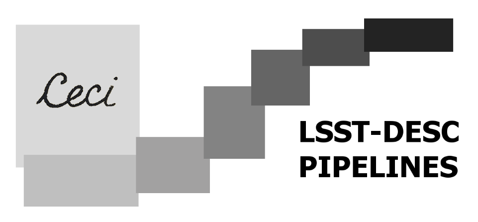

<h2 align="center">Ceci Pipeline Software</h2>

<p align="center">
<a href="https://github.com/LSSTDESC/ceci/actions?query=workflow%3A%22Continuous+Integration%22"></a>
<a href='https://ceci.readthedocs.io/en/latest/?badge=latest'></a>
<a href="https://codecov.io/gh/LSSTDESC/ceci"></a>
<a href="https://pypi.org/project/ceci/"></a>
<a href="https://pepy.tech/project/ceci"></a>
</p>

> “Ceci n'est pas une pipeline.”

A lightweight parsl-based framework for running DESC pipelines.

This is now beta status.

## Install

```bash
pip install ceci
```
This installs the simplest version of ceci, if you want to be able
to use the parsl backend, install instead `ceci[parsl]`.

You can then run an example pipeline from the ceci_lib directory using:

```bash
export PYTHONPATH=$PYTHONPATH:$PWD
ceci test/test.yml
```


Adding Pipeline Stages
----------------------

To make new pipeline stages, you must:

- make a new python package somewhere else, to contain your stages.
- the package must have an `__init__.py` file that should import from `.` all the stages you want to use.
- it must also have a file `__main__.py` with the same contents as the example in `ceci_example`.
- each stage is its own class inheriting from `ceci.PipelineStage`. Each must define its name, inputs, and outputs, and a run method.
- the run method should use the parent methods from `PipelineStage` to get its inputs and outputs etc.
